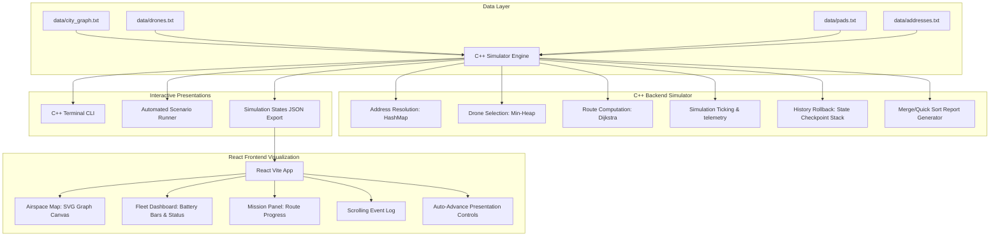
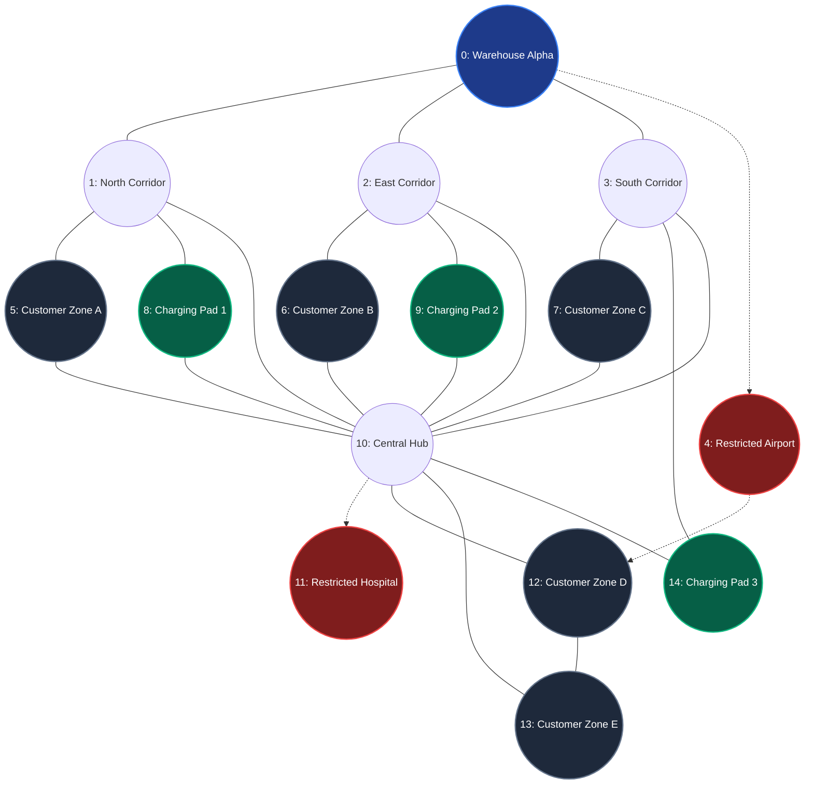

# DRONE-MATRIX: COURIER DISPATCH AND AIRSPACE SIMULATION SYSTEM

Visualisation Host Link: https://drone-martix.vercel.app/

## 2.1 Project Title
**Drone-Matrix: Courier Dispatch and Airspace Simulation System**

---

## 2.2 Problem Statement
In dense urban environments, the deployment of autonomous commercial delivery drones faces critical safety and efficiency challenges. The core problem is coordinating a fleet of quadcopters in real-time under constraints including:
* **Battery Limits**: Drones must maintain a strict energy margin to reach safe landing sites.
* **Restricted Airspace**: Flight paths must avoid No-Fly Zones (e.g., airports, hospital helipads).
* **Airspace Congestion**: Corridors have maximum drone capacities; overloading edges causes deadlock.
* **Environmental Disturbances**: Sudden weather changes (e.g. thunderstorms) require immediate rollback to safe checkpoints and redirection to charging pads.

---

## 2.3 Objectives
* **Automated Scheduling**: Implement a FIFO queue to coordinate incoming delivery orders.
* **Obstacle-Free Routing**: Generate shortest routes using Dijkstra's algorithm that bypass restricted airspace.
* **Safety Audit**: Select candidate drones using a Min-Heap based on calculated energy margins.
* **Traffic Control**: Enforce traffic capacities on flight corridors to prevent bottlenecks.
* **Emergency Management**: Implement weather-induced state rollbacks and routing to charging pads.
* **Visual Presentation**: Build a Vite React skin to animate telemetry and flight paths.

---

## 2.4 System Overview / Architecture

The system decouples the core logic of the simulation from the visual presentation layer.

### System Diagram



### Airspace Network Topology

The airspace graph consists of 15 nodes representing Warehouse Alpha (depot), Customer Delivery Zones, charging pads, waypoints, and Restricted No-Fly Zones (Hospital helipad and Airport).



---

## 2.5 Data Structures and Algorithms Used

The system utilizes optimized standard data structures and routing services:

* **FIFO Queue (`std::queue<Package>`)**: Manages the order queue in first-in, first-out sequence.
* **HashMap (`std::unordered_map<int, Coordinate>`)**: Translates order IDs to GPS coordinates and graph nodes in constant time.
* **Min-Heap (`std::priority_queue<Drone>`)**: Ranks available drones to select the candidate with the highest battery safety margin.
* **Dijkstra's Algorithm**: Calculates obstacle-avoiding shortest paths while bypassing restricted airspace and congested edges.
* **LIFO Stack (`std::stack<FlightState>`)**: Stores history checkpoints per drone to support sequential position and battery rollbacks.
* **Sorting (Merge Sort and Quick Sort)**: Compiles fleet dashboard reports sorted by descending battery levels.

---

## 2.6 Implementation Approach

The C++ backend simulator coordinates classes using constructor dependency injection. 
- The `Simulator` acts as the controller.
- Unordered maps store databases of Drones, Packages, Charging Pads, and Missions.
- In each simulation tick, the controller advances drones, drains battery based on wind and payload penalties, checks edge capacity limits, increments congestion wait thresholds, triggers rollbacks, and validates traffic bounds via `validateTrafficIntegrity()`.
- The decoupled React frontend loads the state outputs to draw map nodes, path corridors, telemetry cards, and scrolling logs.

---

## 2.7 Time and Space Complexity Analysis

| Algorithm/Data Structure | Operation / Scenario | Time Complexity | Space Complexity |
|---|---|---|---|
| **Dijkstra's Pathfinding** | Calculating route path | O((V + E) log V) | O(V + E) |
| **Address Lookup** | HashMap resolution | O(1) average | O(N) |
| **Drone Heap Selection** | Finding best candidate | O(D * (V + E) log V) | O(D + V) |
| **History Stack** | Rollback push/pop | O(1) | O(S) |
| **Merge / Quick Sort** | Fleet reporting | O(N log N) | O(N) |
| **Traffic Integrity Check** | Loop validation | O(V + E) | O(1) |
| **Simulation Tick** | Core update step | O(M * (V + E) log V) | O(M + D) |

Where:
- `V` is the number of coordinate nodes in the city graph.
- `E` is the number of edge corridors.
- `D` is the number of available drones.
- `N` is the database table size.
- `S` is the stack history depth.
- `M` is the count of active flights.

---

## 2.8 Execution Steps

### Prerequisites
- A C++ compiler supporting C++17 (e.g. GCC 8+ or Clang 6+).
- `make` utility.
- Node.js (version 18+) and `npm` installed.

### Setup and Running
1. **Grant permissions**:
   ```bash
   chmod +x run.sh
   ```
2. **Launch all components**:
   ```bash
   ./run.sh
   ```
   This compiles the C++ binaries, starts the local web server on port 5173, and launches the terminal CLI in the foreground. Open [http://localhost:5173](http://localhost:5173) in your browser.

3. **CLI Flags**:
   - `./run.sh --cli` (Run C++ Terminal CLI simulator only)
   - `./run.sh --web` (Run React Web Server only)
   - `./run.sh --demo` (Run automated CLI presentation sequence)
   - `./run.sh --help` (Show all options)

---

## 2.9 Sample Inputs and Outputs

### Sample Input Data (`data/city_graph.txt`)
```text
NODE 0 W Warehouse_Alpha
NODE 1 C North_Corridor_1
NODE 4 R Restricted_Airport
NODE 5 D Customer_Zone_A
EDGE 0 1 5 3
EDGE 1 5 8 2
EDGE 0 4 4 1
```

### Sample Output Log (Tick Progression)
```text
====================
TICK 1
====================
Drone 101
Flew from Node 0 to Node 1 (North_Corridor_1).
Battery: 94% -> 86%
Status: DELIVERING
-------------------
Traffic Integrity Check: Passed (All corridors within capacity limits)
```

---

## 2.11 Results and Observations

During automated scenario runs, the simulator logs system events and outputs a final statistics report:

```text
================================================================================
STAGE 12: FINAL SIMULATION SUMMARY
================================================================================
  * Packages Delivered:            5
  * Restricted Zone Violations:    0
  * Battery Depletion Failures:    0
  * Traffic Integrity Check:       PASSED
      - No flight corridors exceeded capacity.
      - No negative traffic counts detected.
      - Corridor reserve/release lifecycle fully valid.
  * Archived Missions:            5

  [SIMULATION SEQUENCE COMPLETE]
================================================================================
```

### Observations
* **Collision Prevention**: Edge capacity checks successfully blocked entry to full corridors, preventing traffic deadlocks.
* **Energy Margin Efficacy**: Checking landing costs (minimum of returning to warehouse or nearest charging pad) prevented mid-flight battery depletion.
* **Emergency Resilience**: Storm notifications rolled back flights to their last safe checkpoint, preventing gridlocks and successfully redirecting drones to charging pads.

---

## 2.12 Conclusion
Drone-Matrix demonstrates a structured, safety-critical approach to urban drone routing. By combining HashMap-based geographic lookup, Min-Heap drone selection, Dijkstra pathfinding, LIFO checkpoint stacks, and edge capacity locks, the framework coordinates fleet dispatches, manages traffic bottlenecks, and recovers from weather emergencies. The React web skin provides a telemetry dashboard that matches the backend state.
# DSA-DroneMartix
